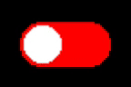

# Buoyant


[](https://crates.io/crates/buoyant)
[](https://docs.rs/buoyant/)

Buoyant is a library for writing and rendering SwiftUI-like views in Rust,
primarily intended for use on `no_std` memory-constrained embedded systems.

Get started with the [📖 Book](https://riley-williams.github.io/buoyant/), or take a
look at the Espresso example.

While this crate is primarily intended for use with embedded-graphics `DrawTarget`s, it
can also be used to render views to the terminal with `crossterm`.

## Example

Here's what a simple animated toggle component could look like:



```rust
fn toggle_button(is_on: bool) -> impl View<Rgb565, bool> {
    let alignment = if is_on { Alignment::Trailing } else { Alignment::Leading };
    let color = if is_on { Rgb565::GREEN } else { Rgb565::RED };

    Button::new(
        |is_on: &mut bool| *is_on = !*is_on,
        |_| {
            Capsule.foreground_color(color)
                .overlay(
                    alignment,
                    Circle
                        .foreground_color(Rgb565::WHITE)
                        .padding(Edges::All, 2)
                )
            .frame_sized(50, 25)
            .animated(Animation::ease_in_out(Duration::from_millis(500)), is_on)
            .geometry_group()
        }
    )
}
```

## Roadmap

### Layout and Rendering

Static layout and animation between layouts are relatively feature-complete, aside from
transitions. You should be able to construct most desired layouts and animations.

- ✅ Stacks of heterogeneous views (VStack, HStack, ZStack)
- ✅ Stacks of homogeneous views (ForEach)
- ✅ Common SwiftUI-like primitives (Spacer, Divider, ...)
- ✅ Common SwiftUI-like modifiers (.frame, .padding, ...)
- ✅ Conditional views, with match variable binding
- ✅ Text (embedded-graphics monospace, u8g2, and rusttype fonts)
- ✅ Images (fixed size)
- ✅ Interruptible Animations + Curves
- 🚧 Transitions (partially implemented)
- ✅ Shape stroke+fill
- ✅ Common embedded-graphics shape primitives
- ✅ Custom sizing with GeometryView
- 🚧 Simulated alpha and antialiasing (rusttype fonts only)
- 🚧 Charts
- 💤 Canvas for arbitrary path/shape/raster drawing
- 💤 Shape styles (e.g. gradients)

### Interactivity

Interactivity is under active development, and is not yet feature-complete.

- ✅ State management
- ✅ Click/tap routing
- ✅ Button
- ✅ ScrollView
- 🚧 Focus management + keyboard input
- 💤 TextField

## Who should use this?

This project could be used in production by the brave, but is probably better suited
for hobby projects at this point. If you're familiar with SwiftUI or Jetpack Compose,
you should feel especially at home.

## License

Licensed under either of

- Apache License, Version 2.0
  ([LICENSE-APACHE](LICENSE-APACHE) or <http://www.apache.org/licenses/LICENSE-2.0>)
- MIT license
  ([LICENSE-MIT](LICENSE-MIT) or <http://opensource.org/licenses/MIT>)

at your option.

## Contribution

Unless you explicitly state otherwise, any contribution intentionally submitted
for inclusion in the work by you, as defined in the Apache-2.0 license, shall be
dual licensed as above, without any additional terms or conditions.
