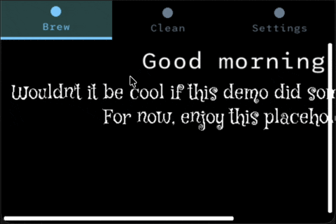

# Buoyant

[](https://crates.io/crates/buoyant)
[](https://docs.rs/buoyant/)



Buoyant is a library for writing and rendering SwiftUI-like views in Rust,
primarily intended for use on `no_std` memory-constrained embedded systems.

Floating point math is aggressively avoided.

Nightly is required.

## Available render targets

- `DrawTarget`: `embedded-graphics` displays.
- `TextBuffer`: A basic fixed-size `char` buffer. Does not respect graphemes.
  This is primarily useful for testing and debugging.
- `CrossTerm`: Renders colored character-pixels to a terminal using
  the `crossterm` crate.

## A Quick Example

Here's what an Apple-like toggle button component would look like,
implemented with Buoyant:

```rust
fn toggle_button(is_on: bool) -> impl Renderable<Rgb565, Renderables: EmbeddedGraphicsRender<Rgb565>> {
    let alignment = if is_on {
        HorizontalAlignment::Trailing
    } else {
        HorizontalAlignment::Leading
    };

    let color = if is_on { Rgb565::GREEN } else { Rgb565::RED };

    ZStack::new((
        Capsule.foreground_color(color),
        Circle.foreground_color(Rgb565::WHITE).padding(2),
    ))
    .with_horizontal_alignment(alignment)
    .frame()
    .with_width(50)
    .with_height(25)
    .animated(Animation::Linear(Duration::from_millis(200)), is_on)
}
```

## Feature progress

### Layout and Rendering

- [x] Fixed-size Stacks with hetereogeneos children (VStack, HStack, ZStack)
- [x] Stacks with homogeneous children (ForEach) - partial, vertical only
- [x] Common SwiftUI primitives (Spacer, Divider)
- [x] Conditional views - partial, no unwrapping
- [x] Text, basic line breaking
- [ ] Text, Unicode line breaking
- [x] Text, monospaced fonts
- [ ] Text, arbitrary fonts
- [x] Animation
- [ ] Transition
- [x] Common embedded-graphics shape primitives
- [ ] Canvas for arbitrary path/shape/raster drawing
- [ ] Shape stroke/fill
- [ ] Shape styles (gradients, fragment shaders)
- [ ] Images
- [ ] Alpha rendering
- [ ] Adaptive antialiasing

### Interactivity

- [ ] State management
- [ ] Click/tap routing
- [ ] Focus management + keyboard input (Text input view)

## Who should use this?

This project should not be used in production...yet. For hobby projects it's
lightyears better than dealing with raw embedded-graphics. If you're familiar
with SwiftUI, you should feel especially at home.

## License

Licensed under either of

- Apache License, Version 2.0
  ([LICENSE-APACHE](LICENSE-APACHE) or <http://www.apache.org/licenses/LICENSE-2.0>)
- MIT license
  ([LICENSE-MIT](LICENSE-MIT) or <http://opensource.org/licenses/MIT>)

at your option.

## Contribution

Unless you explicitly state otherwise, any contribution intentionally submitted
for inclusion in the work by you, as defined in the Apache-2.0 license, shall be
dual licensed as above, without any additional terms or conditions.
