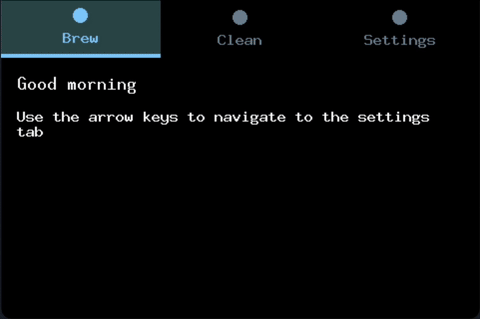

# Buoyant



[](https://crates.io/crates/buoyant)
[](https://docs.rs/buoyant/)

Buoyant is a library for writing and rendering SwiftUI-like views in Rust,
primarily intended for use on `no_std` memory-constrained embedded systems.

Get started with the [Book](https://riley-williams.github.io/buoyant/).

## Available render targets

While this crate is primarily intended for use with embedded-graphics `DrawTarget`s, it
can also be used to layout and render views to the terminal.

- `DrawTarget`: `embedded-graphics` displays.
- `TextBuffer`: A basic fixed-size `char` buffer. Does not respect graphemes.
  This is primarily useful for testing and debugging.
- `CrossTerm`: Renders colored character-pixels to a terminal using
  the `crossterm` crate.

## Example

Here's an animated toggle component, implemented with Buoyant:


```rust
fn toggle_button(is_on: bool) -> impl EmbeddedGraphicsView<Rgb565> {
    let alignment = if is_on {
        HorizontalAlignment::Trailing
    } else {
        HorizontalAlignment::Leading
    };

    let color = if is_on { Rgb565::GREEN } else { Rgb565::RED };

    ZStack::new((
        Capsule.foreground_color(color),
        Circle
            .foreground_color(Rgb565::WHITE)
            .padding(Edges::All, 2),
    ))
    .with_horizontal_alignment(alignment)
    .frame_sized(50, 25)
    .animated(Animation::ease_in_out(Duration::from_millis(500)), is_on)
    .geometry_group()
}
```

## Feature progress

### Layout and Rendering

Static layout and animation between layouts are relatively feature-complete, aside from
transitions. You should be able to construct most desired layouts and animations.

- ✅ Stacks of heterogeneous views (VStack, HStack, ZStack)
- ✅ Stacks of homogeneous views (ForEach) - partial, vertical only
- ✅ Common SwiftUI primitives (Spacer, Divider)
- ✅ Conditional views, with match variable binding
- ✅ Text (embedded-graphics Monospace and [u8g2](https://crates.io/crates/u8g2-fonts) fonts)
- ✅ Images (fixed size)
- ✅ Interruptible Animations + Curves
- ✅ Common embedded-graphics shape primitives
- 🚧 Shape stroke+fill
- 🚧 Canvas for arbitrary path/shape/raster drawing
- 💤 Simulated alpha and antialiasing
- 💤 Transitions
- 💤 Shape styles (e.g. gradients)

### Interactivity

No native interactivity or state management currently exists, but it is the next major
planned feature.

- 💤 State management
- 💤 Click/tap routing
- 💤 Focus management + keyboard input (Text input view)

## Who should use this?

This project could be used in production by the brave, but is probably better suited
for hobby projects at this point. It's significantly better than dealing with raw
embedded-graphics. If you're familiar with SwiftUI, you should feel especially at home.

## License

Licensed under either of

- Apache License, Version 2.0
  ([LICENSE-APACHE](LICENSE-APACHE) or <http://www.apache.org/licenses/LICENSE-2.0>)
- MIT license
  ([LICENSE-MIT](LICENSE-MIT) or <http://opensource.org/licenses/MIT>)

at your option.

## Contribution

Unless you explicitly state otherwise, any contribution intentionally submitted
for inclusion in the work by you, as defined in the Apache-2.0 license, shall be
dual licensed as above, without any additional terms or conditions.
