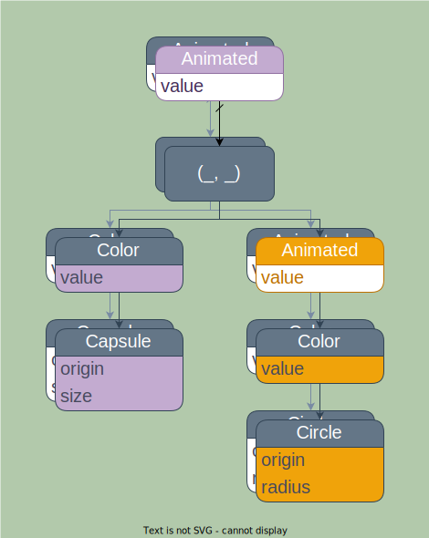

# Compound Animation

When multiple simultaneous and overlapping animations occur, you may see unexpected results.

Imagine what would happen if the toggle from the render tree example had some parent
animation node that was animating a change in the position of the entire toggle:



That animation factor leaks down to the capsule, allowing the capsule to animate between
its old and new positions at a different rate than the circle causing the two to separate!

Although it may seem like the solution is to simply move the animation above the ZStack so
that it contains both elements, this causes a new problem. The circle and capsule animate
together, but the toggle component moves at a different rate than its animated siblings.

## Geometry Group

The solution to this is the `.geometry_group()` modifier. This modifier creates a new
virtual coordinate space within which all children are rendered. Under the influence of
animation, the coordinate space offset is animated, resulting in all children moving
together relative to the geometry group frame.

```rust
# extern crate buoyant;
# extern crate embedded_graphics;
# use std::time::Duration;
# 
# use buoyant::{
#     animation::Animation,
#     layout::Alignment::{Leading, Trailing},
#     view::prelude::*,
# };
# use embedded_graphics::{pixelcolor::Rgb888, prelude::RgbColor as _};
# 
fn toggle(is_on: bool) -> impl View<Rgb888, ()> {
    ZStack::new((
        Capsule.foreground_color(Rgb888::BLACK),
        Circle
            .foreground_color(Rgb888::WHITE)
            .padding(Edges::All, 2)
            .animated(Animation::ease_out(Duration::from_millis(120)), is_on),
    ))
    .with_alignment(if is_on { Trailing } else { Leading })
    .frame_sized(50, 25)
    .geometry_group() // <-----
}
```

Now, the capsule never sees its position change from `(0, 0)` and the circle only ever
sees its position move horizontally.

> Geometry group does not block inherited animation factors from applying to its children.
