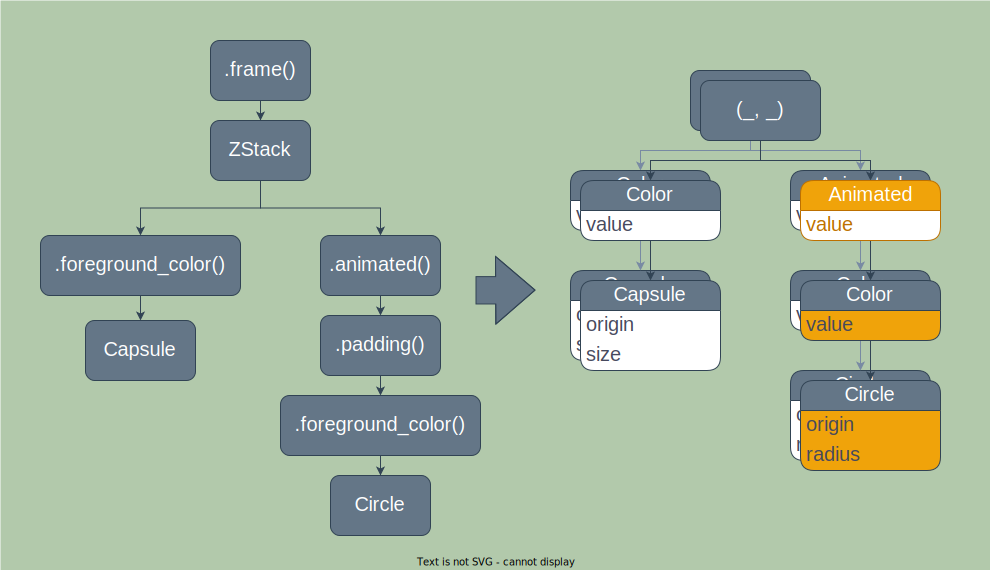

# Render Trees

Rather than directly render your views, Buoyant constructs a tree of render nodes that
represent a snapshot of all the resolved positions, sizes, and colors of your views.
This tree is what is actually rendered.



```rust
# extern crate buoyant;
# extern crate embedded_graphics;
# use std::time::Duration;
# 
# use buoyant::{
#     animation::Animation,
#     layout::Alignment::{Leading, Trailing},
#     view::{
#         padding::Edges,
#         shape::{Capsule, Circle},
#         View, ViewExt as _, ZStack,
#     },
# };
# use embedded_graphics::{pixelcolor::Rgb888, prelude::RgbColor as _};
# 
fn toggle(is_on: bool) -> impl View<Rgb888> {
    ZStack::new((
        Capsule.foreground_color(Rgb888::BLACK),
        Circle
            .foreground_color(Rgb888::WHITE)
            .padding(Edges::All, 2)
            .animated(Animation::ease_out(Duration::from_millis(120)), is_on),
    ))
    .with_alignment(if is_on { Trailing } else { Leading })
    .frame_sized(50, 25)
}
```

In the animated toggle above, the alignment of the circle changes from `Alignment::Leading`
to `Alignment::Trailing`, moving it between the left and right sides of the capsule.

Rather than attempting to figure out what it means to animate between `Leading` and `Trailing`,
the absolute position and radius of the circle is animated from one tree to the next.

This is generally true, and when you specify an animation, you aren't actually animating
between the properties of the view but rather the properties of the resultant render tree.
Because all render trees of the same view are the exact same type, interpolating between
them is both cheap and easy.

> Notice how some view nodes do not produce a render node. The render tree contains only
> the bare minimum information needed to render the view.

## Memory Usage Considerations

Because each render tree contains a complete snapshot of your views, there are a couple
ways you can accidentally end up using more memory than you expected. This may be obvious,
but the render tree must hold a copy of any value that changes between views to satisfy
the borrow checker.

Wherever possible, prefer using borrowed types like `&str` for static text where only the
reference will be cloned.

Be mindful of the size of values you pass to `.animated()`. The value will be cloned,
and a copy stored in each render tree. If you must track a large value, consider
using a hash instead of the value itself.
