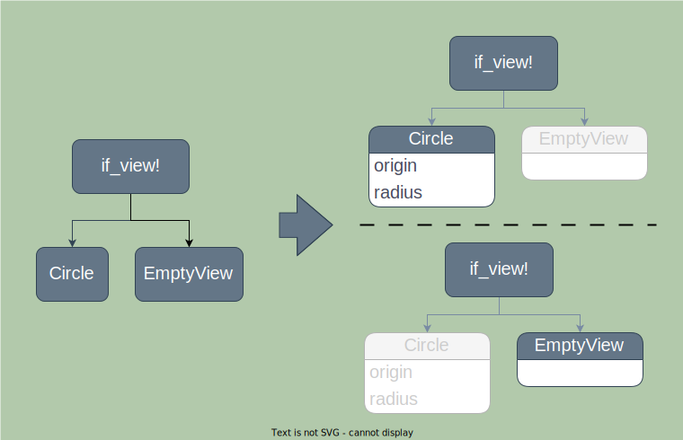

# Transitions

Transitions occur when you have a conditional view like `if_view!` or `match_view!` which
changes branches. Because the branches contain different subtrees, there is no
reasonable way to animate between them. In cases like this, the conditional
view uses a transition to animate between the two branches.



> The properties of views within unchanged branches are still animated as normal.

## Configuring Transitions

The `Opacity` transition is used by default, but it can be changed with the `.transition()`
modifier.

```rust
# extern crate buoyant;
# extern crate embedded_graphics;
# use embedded_graphics::pixelcolor::Rgb888;
# use std::time::Duration;
use buoyant::{
    if_view,
    view::prelude::*,
    transition::{Move, Slide},
};

fn maybe_round(is_square: bool) -> impl View<Rgb888, ()> {
    if_view!((is_square) {
        Rectangle
          .frame_sized(20, 20)
          .transition(Slide::leading())
    } else {
        Circle
          .frame_sized(20, 20)
          .transition(Move::top())
    })
    .animated(Animation::ease_out(Duration::from_millis(120)), is_square)
}
```

Transitions must have some parent animation node with a `value` that matches the condition
for the transition or they will not animate. The transition duration is determined by the
animation node driving it.

For transitions like `Move` and `Slide`, the size of the *whole transitioning subtree* is used
to determine how far to move the view. The transition modifier does not need to be the
outermost modifier, and where you place it has no bearing on the resulting effect.

These two views produce the exact same transition:

```rust
# extern crate buoyant;
# extern crate embedded_graphics;
# use embedded_graphics::pixelcolor::Rgb888;
# use std::time::Duration;
# use buoyant::{
#     if_view,
#     view::prelude::*,
#     transition::{Move, Slide},
# };
# 
fn all_the_same_1(is_square: bool) -> impl View<Rgb888, ()> {
    if_view!((is_square) {
        Rectangle
          .frame_sized(20, 20)
          .padding(Edges::All, 5)
          .transition(Slide::leading()) // Outermost modifier
    })
    .animated(Animation::ease_out(Duration::from_millis(120)), is_square)
}

fn all_the_same_2(is_square: bool) -> impl View<Rgb888, ()> {
    if_view!((is_square) {
        Rectangle
          .transition(Slide::leading()) // Innermost modifier
          .frame_sized(20, 20)
          .padding(Edges::All, 5)
    })
    .animated(Animation::ease_out(Duration::from_millis(120)), is_square)
}

```

## Where To Apply Transitions

For views like `VStack` where there is no obvious way to choose between the
transitions requested by its children, the default `Opacity` will be used.

The transitions applied inside the stack here have no effect:

```rust
# extern crate buoyant;
# extern crate embedded_graphics;
# use embedded_graphics::pixelcolor::Rgb888;
# use std::time::Duration;
# use buoyant::{
#     if_view,
#     view::prelude::*,
#     transition::{Move, Slide},
# };
# 
fn lost_in_the_stacks(thing: bool) -> impl View<Rgb888, ()> {
    if_view!((thing) {
        VStack::new((
            Rectangle.transition(Slide::trailing()),
            Rectangle.transition(Move::leading())
      )) // .transition(...) <-- Here would work!
    })
    .animated(Animation::ease_out(Duration::from_millis(120)), thing)
}
```

To get the stack in this example to transition, apply the transition *outside the stack*.

## Prefer Computed Properties

Unless transitioning is the desired behavior, prefer using computed properties over
conditional views when the conditional view's branches are the same type.

```rust
# extern crate buoyant;
# extern crate embedded_graphics;
# use buoyant::{
#     if_view,
#     view::prelude::*,
# };
# use embedded_graphics::pixelcolor::Rgb888;
# 
/// This will jump between two different rectangles
fn bar1(is_wide: bool) -> impl View<Rgb888, ()> {
    if_view!((is_wide) {
        Rectangle.frame_sized(100, 5)
    } else {
        Rectangle.frame_sized(20, 5)
    })
}

/// This will animate the frame of the Rectangle
fn bar2(is_wide: bool) -> impl View<Rgb888, ()> {
    Rectangle.frame_sized(if is_wide { 100 } else { 20 }, 5)
}
```
