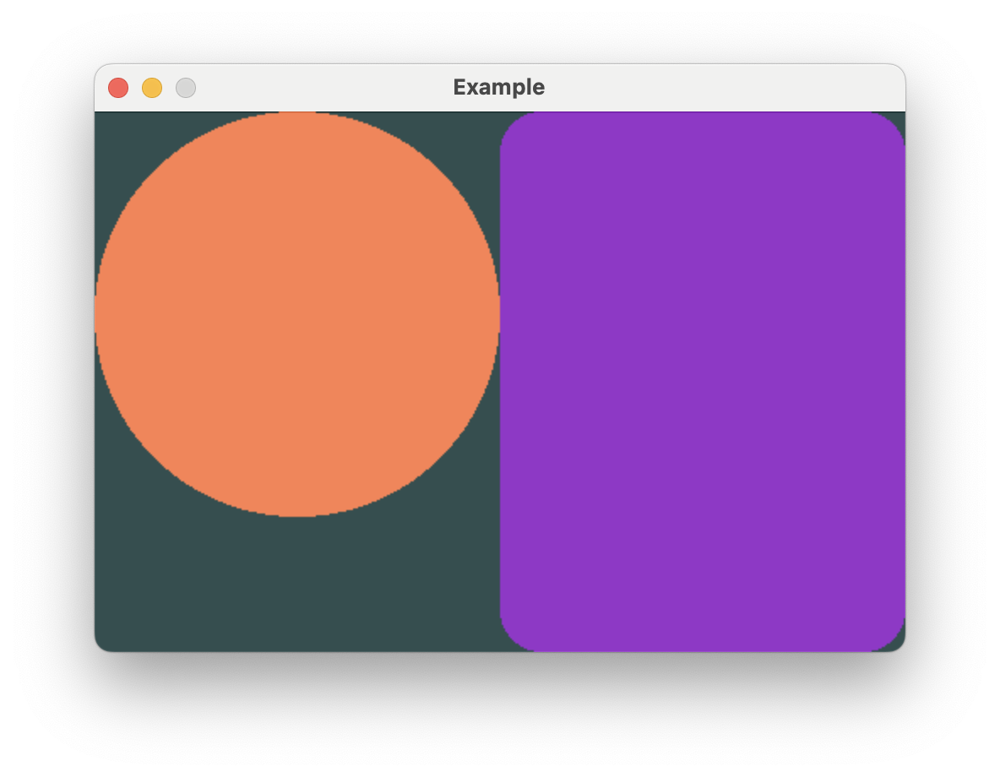

# Alignment

When arranging elements in stacks, placement ambiguity can arise when the child
views differ in length along the axis opposite to the arrangement axis.

Vertical stacks can have horizontal alignment ambiguity, and horizontal stacks
can have vertical alignment ambiguity.

In the previous example, the ``HStack`` height resolved to the full window height
because ``Rectangle`` takes height greedily. But the ``Circle`` frame is shorter
so Buoyant needs to make a decision about where to place it. This ambiguity was
resolved using the default, ``Center``, but you can change it by calling
`.with_alignment()` on the stack.

If you wanted to align the ``Circle`` from the previous example to the top edge,
you could set ``VerticalAlignment::Top``.



```rust,no_run
# extern crate buoyant;
# extern crate embedded_graphics;
# extern crate embedded_graphics_simulator;
# use embedded_graphics::{pixelcolor::Rgb888, prelude::*};
# use embedded_graphics_simulator::{OutputSettings, SimulatorDisplay, Window};
# 
# const BACKGROUND_COLOR: Rgb888 = Rgb888::CSS_DARK_SLATE_GRAY;
# const DEFAULT_COLOR: Rgb888 = Rgb888::WHITE;
# 
# fn main() {
#     let mut window = Window::new("Example", &OutputSettings::default());
#     let mut display: SimulatorDisplay<Rgb888> = SimulatorDisplay::new(Size::new(480, 320));
# 
#     display.clear(BACKGROUND_COLOR).unwrap();
# 
#     view()
#         .as_drawable(display.size(), DEFAULT_COLOR)
#         .draw(&mut display)
#         .unwrap();
# 
#     window.show_static(&display);
# }
# 
use buoyant::view::prelude::*;

fn view() -> impl View<Rgb888> {
    HStack::new((
        Circle.foreground_color(Rgb888::CSS_CORAL),
        Rectangle
            .corner_radius(25)
            .foreground_color(Rgb888::CSS_DARK_ORCHID),
    ))
    .with_alignment(VerticalAlignment::Top)
}
```

You'll see this ambiguity arise again with `ZStack` and the frame modifiers.

## A note on how SwiftUI alignment differs

If you're coming from SwiftUI, your understanding of alignment is most likely a bit wrong.
This is probably fine, and conveniently, if you're wrong about SwiftUI you probably
already have the correct understanding of alignment in Buoyant!

I think it's worth briefly explaining how SwiftUI alignment actually works and what that
means for special alignments you can't build (yet) in Buoyant. Feel free to skip this if
you're totally new to both and feeling lost.

Using HStack as an example, when you specify `.bottom` vertical alignment in SwiftUI you are
*not* telling the HStack to align all the children to the bottom edge of the stack. You are
telling it to align the `.bottom` *alignment guides* of all the children. Each child view
reports a set of named marks, called alignment guides, which the stack uses for alignment.
While generally you can assume `.top` is placed at y = 0 and `.bottom` is placed at y =
frame.height, views are free to place these guides wherever they want. The stack simply
lines up the mark across all the children. Custom marks are even preserved when nesting
views inside other modifiers.

This is especially useful when you have a horizontal stack containing text of multiple sizes.
You can tell SwiftUI to align the text baselines, giving a much more visually appealing result.

Buoyant does not have this feature, but I recognize the utility it provides. For now, you can
only align to the center and outer edges. Thinking about alignment in terms of "Top aligns
views to the top" *is* correct for Buoyant.
