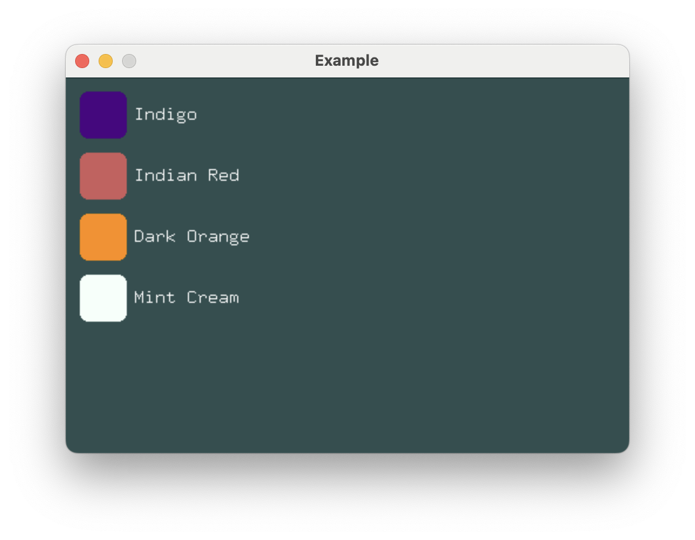

# Collections

In the [Stack Spacing](./stack-spacing.md) section, `VStack` was used to create what looks
suspiciously like a list of identical rows. For this purpose, `ForEach` is typically a
better choice. Use ForEach when you want to display a collection of like views.



```rust,no_run
# extern crate buoyant;
# extern crate embedded_graphics;
# extern crate embedded_graphics_simulator;
# use buoyant::{
#     environment::DefaultEnvironment,
#     layout::Layout,
#     render::{EmbeddedGraphicsRender, EmbeddedGraphicsView, Renderable},
# };
# use embedded_graphics_simulator::{OutputSettings, SimulatorDisplay, Window};
#
# const BACKGROUND_COLOR: Rgb888 = Rgb888::CSS_DARK_SLATE_GRAY;
# const DEFAULT_COLOR: Rgb888 = Rgb888::WHITE;
#
# fn main() {
#     let mut window = Window::new("Example", &OutputSettings::default());
#     let mut display: SimulatorDisplay<Rgb888> = SimulatorDisplay::new(Size::new(480, 320));
#
#     display.clear(BACKGROUND_COLOR).unwrap();
#
#     let environment = DefaultEnvironment::default();
#     let origin = buoyant::primitives::Point::zero();
#
#     let view = view(&SWATCHES);
#     let layout = view.layout(&display.size().into(), &environment);
#     let render_tree = view.render_tree(&layout, origin, &environment);
#
#     render_tree.render(&mut display, &DEFAULT_COLOR, origin);
#
#     window.show_static(&display);
# }
#
# mod spacing {
#     pub const ELEMENT: u16 = 6;
#     pub const COMPONENT: u16 = 12;
# }
#
# struct Swatch {
#     name: &'static str,
#     color: Rgb888,
# }
#
use buoyant::layout::HorizontalAlignment;
use buoyant::view::padding::Edges;
use buoyant::view::{shape::RoundedRectangle, ForEach, HStack, Text};
use buoyant::view::{LayoutExtensions as _, RenderExtensions as _};
use embedded_graphics::{mono_font::ascii::FONT_9X15, pixelcolor::Rgb888, prelude::*};

static SWATCHES: [Swatch; 4] = [
    Swatch {
        name: "Indigo",
        color: Rgb888::CSS_INDIGO,
    },
    Swatch {
        name: "Indian Red",
        color: Rgb888::CSS_INDIAN_RED,
    },
    Swatch {
        name: "Dark Orange",
        color: Rgb888::CSS_DARK_ORANGE,
    },
    Swatch {
        name: "Mint Cream",
        color: Rgb888::CSS_MINT_CREAM,
    },
];

fn view(swatches: &[Swatch]) -> impl EmbeddedGraphicsView<Rgb888> + use<'_> {
    ForEach::<10>::new(swatches, |swatch| {
        HStack::new((
            RoundedRectangle::new(8)
                .foreground_color(swatch.color)
                .frame()
                .with_width(40)
                .with_height(40),
            Text::new(swatch.name, &FONT_9X15).foreground_color(Rgb888::WHITE),
        ))
        .with_spacing(spacing::ELEMENT)
    })
    .with_alignment(HorizontalAlignment::Leading)
    .with_spacing(spacing::COMPONENT)
    .padding(Edges::All, spacing::COMPONENT)
}
```

`ForEach` requires you to provide a `const` size, and will lay out and render up to that
many items. As with `VStack`, the alignment and spacing of its subviews can be controlled.

```rust
# extern crate buoyant;
# use buoyant::view::{shape::RoundedRectangle, ForEach};
let radii = [1, 2, 3, 4, 5, 6, 7, 8, 9, 10];

ForEach::<10>::new(&radii, |radius| {
    RoundedRectangle::new(*radius)
});
```

The provided closure will be called for each item in the collection to produce a view.

While the rows in this example are simple and mostly identical, conditional views can be
used to create the illusion of heterogeneity.

## Performance Considerations and Future Work

### Diff Animation

Buoyant does not currently support animating between orderings of a collection, and
will simply snap to the new ordering. This does not appear to be a difficult problem to
solve and the API of `ForEach` is expected to change in future versions to accommodate it.
It is likely to be through the introduction of an additional trait bound on the slice values.

### Offscreen Elements

Laying out large collections can be expensive, especially when the collection is only
partially onscreen. Ideally, Buoyant would attempt to guess at the size of the offscreen
elements and reserve the `N` slots for items that are actually visible. Expect to see this
behavior eventually implemented, but there is a lot of core functionality that must be
built first.
