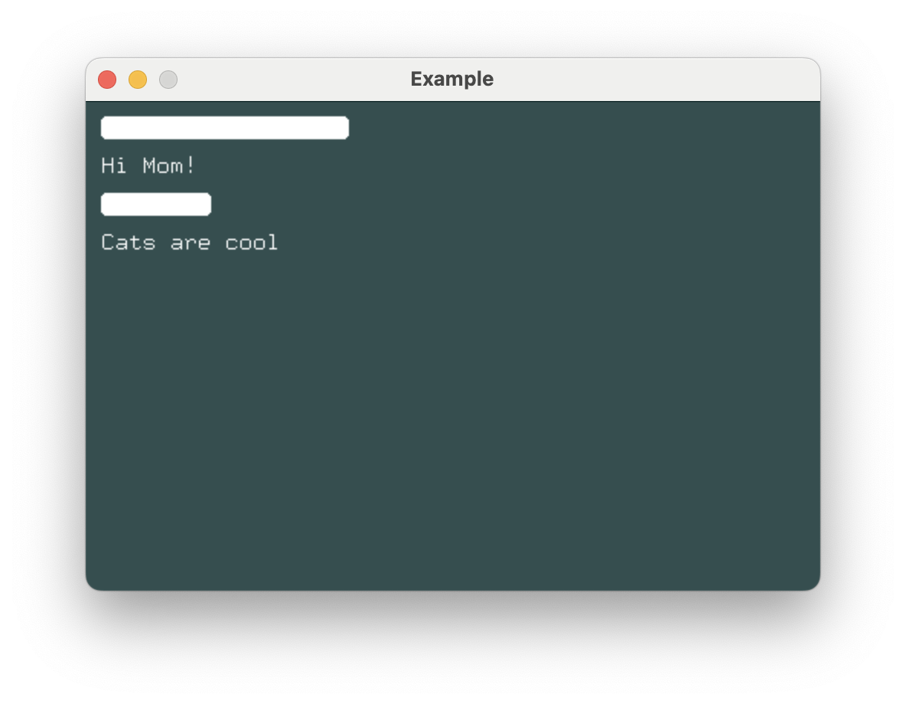
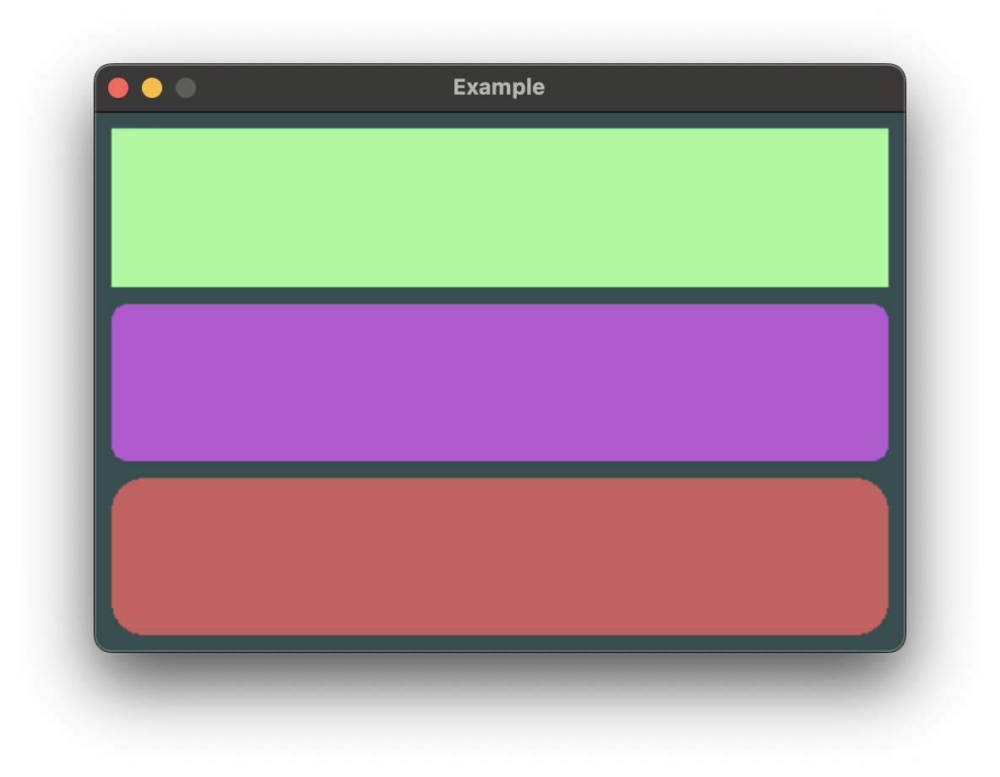

# Conditional Views

Buoyant uses statically typed view trees to render content.

If you try something simple like this:

```rust,compile_fail
# extern crate buoyant;
# extern crate embedded_graphics;
# use buoyant::render::EmbeddedGraphicsView;
# use buoyant::view::{Text, shape::Rectangle};
# use embedded_graphics::{mono_font::ascii::FONT_9X15, pixelcolor::Rgb888, prelude::*};
#
fn view(is_redacted: bool) -> impl EmbeddedGraphicsView<Rgb888> {
    if is_redacted {
        Rectangle
    } else {
        Text::new("This is visible!", &FONT_9X15)
    }
}
```

You'll of course get an error telling you that the types returned from each branch don't
match.

## Conditional Views with `if_view!`

To do this, one option is to use the `if_view!` macro.

Both branches of the `if` are instantiated, but only one is actually used to perform
layout and rendering.



```rust,no_run
# extern crate buoyant;
# extern crate embedded_graphics;
# extern crate embedded_graphics_simulator;
# use buoyant::{
#     environment::DefaultEnvironment,
#     layout::Layout,
#     render::{EmbeddedGraphicsRender, EmbeddedGraphicsView, Renderable},
# };
# use embedded_graphics_simulator::{OutputSettings, SimulatorDisplay, Window};
# 
# const BACKGROUND_COLOR: Rgb888 = Rgb888::CSS_DARK_SLATE_GRAY;
# const DEFAULT_COLOR: Rgb888 = Rgb888::WHITE;
# 
# fn main() {
#     let mut window = Window::new("Example", &OutputSettings::default());
#     let mut display: SimulatorDisplay<Rgb888> = SimulatorDisplay::new(Size::new(480, 320));
# 
#     display.clear(BACKGROUND_COLOR).unwrap();
# 
#     let environment = DefaultEnvironment::default();
#     let origin = buoyant::primitives::Point::zero();
# 
#     let view = view();
#     let layout = view.layout(&display.size().into(), &environment);
#     let render_tree = view.render_tree(&layout, origin, &environment);
# 
#     render_tree.render(&mut display, &DEFAULT_COLOR, origin);
# 
#     window.show_static(&display);
# }
# 
use buoyant::if_view;
use buoyant::view::{padding::Edges, shape::RoundedRectangle, LayoutExtensions as _, Text, VStack};
use embedded_graphics::{mono_font::ascii::FONT_9X15, pixelcolor::Rgb888, prelude::*};

fn secret_message(message: &str, is_redacted: bool) -> impl EmbeddedGraphicsView<Rgb888> + use<'_> {
    if_view!((is_redacted) {
        RoundedRectangle::new(4)
            .frame()
            .with_width(9 * message.len() as u16) // yeah yeah ignoring UTF8
            .with_height(15)
    } else {
        Text::new(message, &FONT_9X15)
    })
}

fn view() -> impl EmbeddedGraphicsView<Rgb888> {
    VStack::new((
        secret_message("Top secret message", true),
        secret_message("Hi Mom!", false),
        secret_message("hunter12", true),
        secret_message("Cats are cool", false),
    ))
    .with_spacing(10)
    .with_alignment(buoyant::layout::HorizontalAlignment::Leading)
    .padding(Edges::All, 10)
}
```

## Variable Binding with `match_view!`

The `match_view!` macro is a more powerful version of `if_view!` that allows you to bind
variables in the match arms.



```rust,no_run
# extern crate buoyant;
# extern crate embedded_graphics;
# extern crate embedded_graphics_simulator;
# use buoyant::{
#     environment::DefaultEnvironment,
#     layout::Layout,
#     render::{EmbeddedGraphicsRender, EmbeddedGraphicsView, Renderable},
#     view::EmptyView,
# };
# use embedded_graphics_simulator::{OutputSettings, SimulatorDisplay, Window};
#
# const BACKGROUND_COLOR: Rgb888 = Rgb888::CSS_DARK_SLATE_GRAY;
# const DEFAULT_COLOR: Rgb888 = Rgb888::WHITE;
#
# fn main() {
#     let mut window = Window::new("Example", &OutputSettings::default());
#     let mut display: SimulatorDisplay<Rgb888> = SimulatorDisplay::new(Size::new(480, 320));
#
#     display.clear(BACKGROUND_COLOR).unwrap();
#
#     let environment = DefaultEnvironment::default();
#     let origin = buoyant::primitives::Point::zero();
#
#     let view = view();
#     let layout = view.layout(&display.size().into(), &environment);
#     let render_tree = view.render_tree(&layout, origin, &environment);
#
#     render_tree.render(&mut display, &DEFAULT_COLOR, origin);
#
#     window.show_static(&display);
# }
#
use buoyant::match_view;
use buoyant::view::shape::{Rectangle, RoundedRectangle};
use buoyant::view::{padding::Edges, LayoutExtensions as _, RenderExtensions as _, VStack};
use embedded_graphics::{pixelcolor::Rgb888, prelude::*};

#[derive(Debug, Clone, Copy)]
enum Shape {
    Rectangle,
    RoundedRect(u16),
    None,
}

fn shape(shape: Shape) -> impl EmbeddedGraphicsView<Rgb888> {
    match_view!(shape => {
        Shape::Rectangle => {
            Rectangle
        },
        Shape::RoundedRect(radius) => {
            RoundedRectangle::new(radius)
        },
        Shape::None => {
            EmptyView
        }
    })
}

fn view() -> impl EmbeddedGraphicsView<Rgb888> {
    VStack::new((
        shape(Shape::Rectangle)
            .foreground_color(Rgb888::CSS_PALE_GREEN),
        shape(Shape::RoundedRect(10))
            .foreground_color(Rgb888::CSS_MEDIUM_ORCHID),
        shape(Shape::None)
            .foreground_color(Rgb888::WHITE),
        shape(Shape::RoundedRect(30))
            .foreground_color(Rgb888::CSS_INDIAN_RED),
    ))
    .with_spacing(10)
    .padding(Edges::All, 10)
}
```

## Maintaining Consistent Spacing with `EmptyView`

Notice how despite returning a view for the `Shape::None` variant above, the correct spacing
remains between its neighbors. `EmptyView` is useful when you must return a view, but
don't want anything to be rendered and don't want to disrupt stack spacing. Note that
not all modifiers will transfer this spacing behavior when applied to an `EmptyView`

When an `if_view!` does not specify an else, `EmptyView` is implied for the else branch.

```rust
# extern crate buoyant;
# extern crate embedded_graphics;
# use buoyant::render::EmbeddedGraphicsView;
# use embedded_graphics::pixelcolor::Rgb888;
# use embedded_graphics::mono_font::ascii::FONT_9X15;
use buoyant::view::{Text, shape::Rectangle};
use buoyant::if_view;

/// A rectangle if not hidden, otherwise implicit `EmptyView`
fn maybe_rectangle(hidden: bool) -> impl EmbeddedGraphicsView<Rgb888> {
    if_view!((!hidden) {
        Rectangle
    })
}
```
