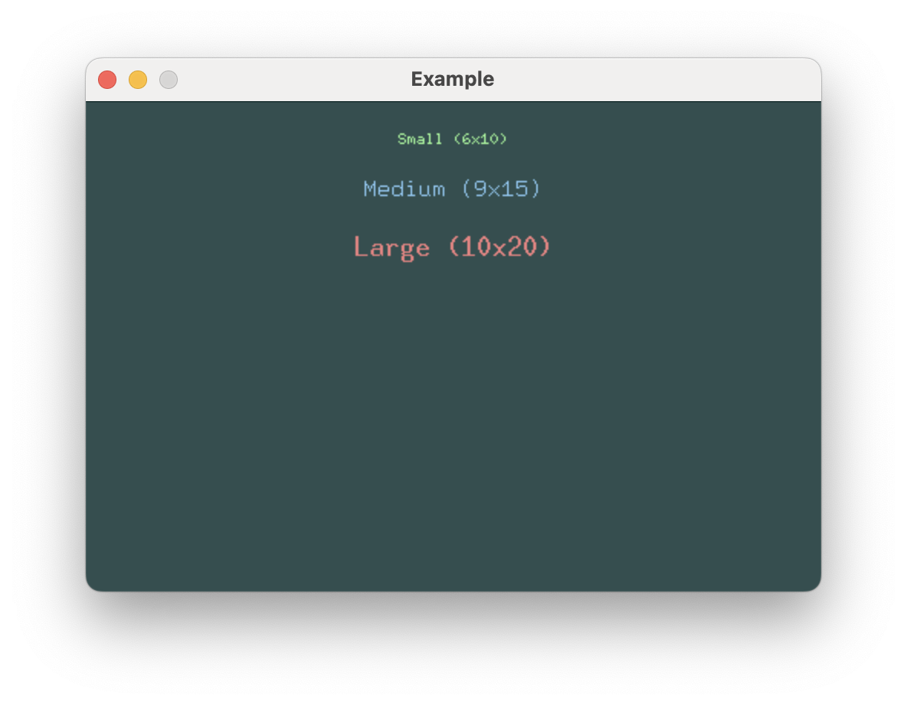
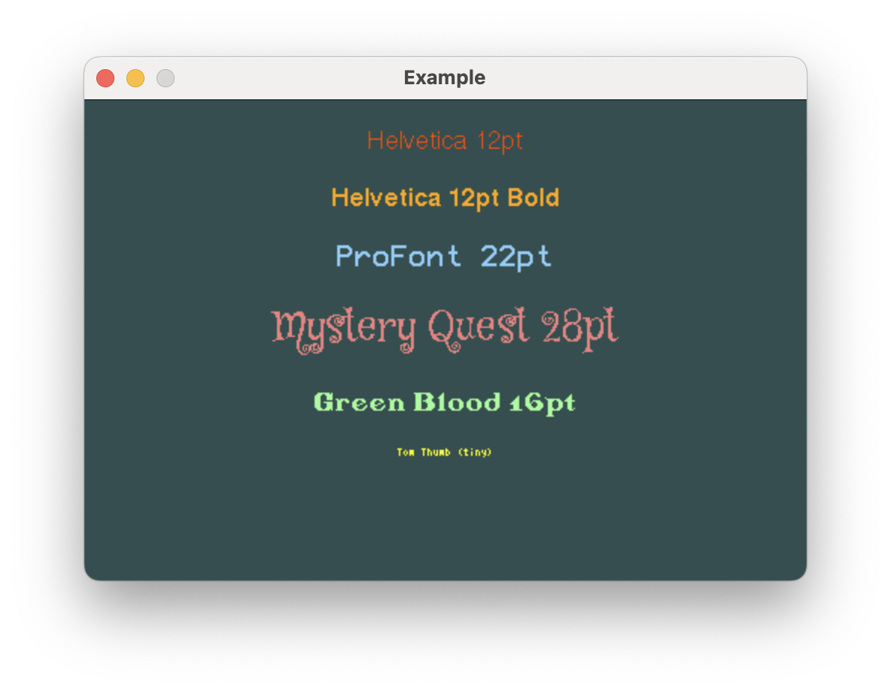

# Fonts

Buoyant currently supports two font systems:

1. **Embedded Graphics Monospace Fonts**: Fixed-width fonts from the `embedded-graphics` crate,
   perfect for simple displays and consistent spacing.

2. **U8g2 Fonts**: A rich collection of fonts ported from the U8g2 library, offering more
  variety in styles and sizes.

## Using Embedded Graphics Fonts

The `embedded-graphics` crate provides a selection of fixed-width fonts that work well
with Buoyant. These bitmapped fonts are easy to use and render quickly, making them ideal for
text in animation-heavy applications.



```rust,no_run
# extern crate buoyant;
# extern crate embedded_graphics;
# extern crate embedded_graphics_simulator;
# use buoyant::view::AsDrawable as _;
# use embedded_graphics::{pixelcolor::Rgb888, prelude::*};
# use embedded_graphics_simulator::{OutputSettings, SimulatorDisplay, Window};
# 
# const BACKGROUND_COLOR: Rgb888 = Rgb888::CSS_DARK_SLATE_GRAY;
# const DEFAULT_COLOR: Rgb888 = Rgb888::WHITE;
# 
# fn main() {
#     let mut window = Window::new("Example", &OutputSettings::default());
#     let mut display: SimulatorDisplay<Rgb888> = SimulatorDisplay::new(Size::new(480, 320));
# 
#     display.clear(BACKGROUND_COLOR).unwrap();
# 
#     view()
#         .as_drawable(display.size(), DEFAULT_COLOR)
#         .draw(&mut display)
#         .unwrap();
# 
#     window.show_static(&display);
# }
# 
use buoyant::layout::HorizontalAlignment;
use buoyant::view::{padding::Edges, Text, VStack, View, ViewExt as _};
use embedded_graphics::mono_font::ascii::{FONT_10X20, FONT_6X10, FONT_9X15};

fn view() -> impl View<Rgb888> {
    VStack::new((
        Text::new("Small (6x10)", &FONT_6X10)
            .foreground_color(Rgb888::CSS_PALE_GREEN),
        Text::new("Medium (9x15)", &FONT_9X15)
            .foreground_color(Rgb888::CSS_LIGHT_SKY_BLUE),
        Text::new("Large (10x20)", &FONT_10X20)
            .foreground_color(Rgb888::CSS_LIGHT_CORAL),
    ))
    .with_spacing(20)
    .with_alignment(HorizontalAlignment::Center)
    .flex_infinite_width(HorizontalAlignment::Center)
    .padding(Edges::All, 20)
}
```

## Using U8g2 Fonts

For more font variety, Buoyant supports the U8g2 font collection through the [`u8g2-fonts`](https://crates.io/crates/u8g2-fonts)
crate. This gives you access to many different font styles and sizes, but at a greater
cost to render.

The original [u8g2 wiki](https://github.com/olikraus/u8g2/wiki/fntlistall)
is the best catalog to search for specific u8g2 fonts.



```rust,no_run
# extern crate buoyant;
# extern crate embedded_graphics;
# extern crate embedded_graphics_simulator;
# extern crate u8g2_fonts;
# use buoyant::view::AsDrawable as _;
# use embedded_graphics::{pixelcolor::Rgb888, prelude::*};
# use embedded_graphics_simulator::{OutputSettings, SimulatorDisplay, Window};
# 
# const BACKGROUND_COLOR: Rgb888 = Rgb888::CSS_DARK_SLATE_GRAY;
# const DEFAULT_COLOR: Rgb888 = Rgb888::WHITE;
# 
# fn main() {
#     let mut window = Window::new("Example", &OutputSettings::default());
#     let mut display: SimulatorDisplay<Rgb888> = SimulatorDisplay::new(Size::new(480, 320));
# 
#     display.clear(BACKGROUND_COLOR).unwrap();
# 
#     view()
#         .as_drawable(display.size(), DEFAULT_COLOR)
#         .draw(&mut display)
#         .unwrap();
# 
#     window.show_static(&display);
# }
# 
use buoyant::layout::HorizontalAlignment;
use buoyant::view::{padding::Edges, Text, VStack, View, ViewExt as _};
use u8g2_fonts::{fonts, FontRenderer};

static HELVETICA: FontRenderer = FontRenderer::new::<fonts::u8g2_font_helvR12_tr>();
static HELVETICA_BOLD: FontRenderer = FontRenderer::new::<fonts::u8g2_font_helvB12_tr>();
static PROFONT_22: FontRenderer = FontRenderer::new::<fonts::u8g2_font_profont22_mr>();
static MYSTERY_QUEST_28: FontRenderer = FontRenderer::new::<fonts::u8g2_font_mystery_quest_28_tr>();
static GREENBLOOD: FontRenderer = FontRenderer::new::<fonts::u8g2_font_greenbloodserif2_tr>();
static TOM_THUMB: FontRenderer = FontRenderer::new::<fonts::u8g2_font_tom_thumb_4x6_mr>();

fn view() -> impl View<Rgb888> {
    VStack::new((
        Text::new("Helvetica 12pt", &HELVETICA)
            .foreground_color(Rgb888::CSS_ORANGE_RED),
        Text::new("Helvetica 12pt Bold", &HELVETICA_BOLD)
            .foreground_color(Rgb888::CSS_ORANGE),
        Text::new("ProFont 22pt", &PROFONT_22)
            .foreground_color(Rgb888::CSS_LIGHT_SKY_BLUE),
        Text::new("Mystery Quest 28pt", &MYSTERY_QUEST_28)
            .foreground_color(Rgb888::CSS_LIGHT_CORAL),
        Text::new("Green Blood 16pt", &GREENBLOOD)
            .foreground_color(Rgb888::CSS_PALE_GREEN),
        Text::new("Tom Thumb (tiny)", &TOM_THUMB)
            .foreground_color(Rgb888::CSS_YELLOW),
    ))
    .with_spacing(20)
    .with_alignment(HorizontalAlignment::Center)
    .flex_infinite_width(HorizontalAlignment::Center)
    .padding(Edges::All, 20)
}
```
