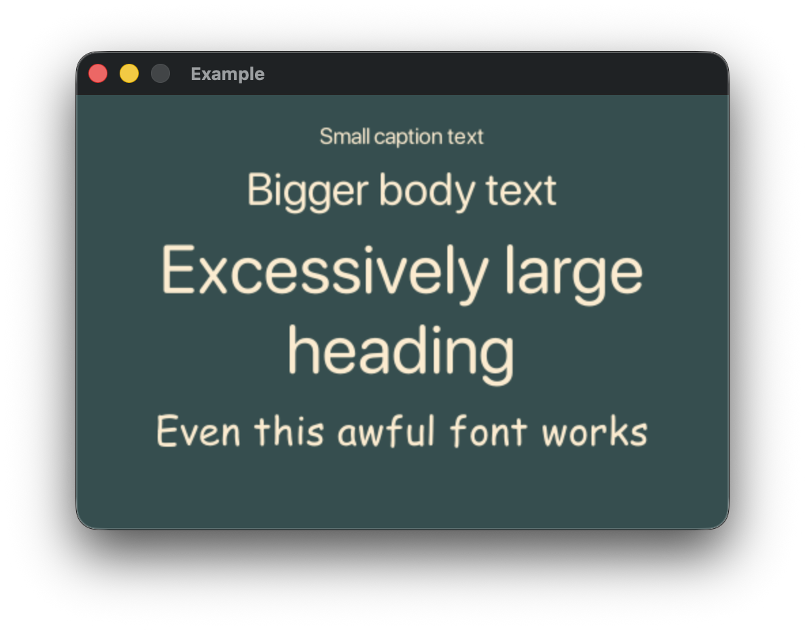

# RustType Fonts

OpenType fonts loaded with `rusttype` are rendered with the `embedded_ttf` crate,
providing high-quality text rendering with support for variable sizing and antialiasing.



```rust,ignore
# // MDBook does not appear to support include_bytes!, so this example is marked ignore.
# // If you find this example broken, please open an issue :)
# extern crate buoyant;
# extern crate embedded_graphics;
# extern crate embedded_graphics_simulator;
# extern crate rusttype;
# use embedded_graphics::{pixelcolor::Rgb888, prelude::*};
# use embedded_graphics_simulator::{OutputSettings, SimulatorDisplay, Window};
# 
# const BACKGROUND_COLOR: Rgb888 = Rgb888::CSS_DARK_SLATE_GRAY;
# const DEFAULT_COLOR: Rgb888 = Rgb888::WHITE;
# 
# fn main() {
#     let mut window = Window::new("Example", &OutputSettings::default());
#     let mut display: SimulatorDisplay<Rgb888> = SimulatorDisplay::new(Size::new(480, 320));
# 
#     display.clear(BACKGROUND_COLOR).unwrap();
# 
#     view()
#         .as_drawable(display.size(), DEFAULT_COLOR, &mut ())
#         .draw(&mut display)
#         .unwrap();
# 
#     window.show_static(&display);
# }
# 
use buoyant::view::prelude::*;
use std::sync::LazyLock;

static SF_ROUNDED: LazyLock<rusttype::Font<'static>> = LazyLock::new(|| {
    let bytes = include_bytes!("fonts/SF-Pro-Rounded-Regular.otf");
    rusttype::Font::try_from_bytes(bytes).unwrap()
});

static COMIC_SANS: LazyLock<rusttype::Font<'static>> = LazyLock::new(|| {
    let bytes = include_bytes!("fonts/Comic Sans MS.ttf");
    rusttype::Font::try_from_bytes(bytes).unwrap()
});

fn view() -> impl View<Rgb888, ()> {
    VStack::new((
        Text::new("Small caption text", &*SF_ROUNDED).with_font_size(20),
        Text::new("Bigger body text", &*SF_ROUNDED).with_font_size(40),
        Text::new("Excessively large heading", &*SF_ROUNDED)
            .with_font_size(60)
            .multiline_text_alignment(HorizontalTextAlignment::Center),
        Text::new("Even this awful font works", &*COMIC_SANS).with_font_size(40),
    ))
    .with_spacing(10)
    .with_alignment(HorizontalAlignment::Center)
    .foreground_color(Rgb888::CSS_BLANCHED_ALMOND)
    .flex_infinite_width(HorizontalAlignment::Center)
    .padding(Edges::All, 20)
    .hint_background_color(BACKGROUND_COLOR)
}
```

## Loading RustType Fonts

`rusttype::Font::try_from_bytes(bytes)` is not a `const` fn, so fonts must be
initialized at runtime.

Depending on the features available and desired functionality, different static
initialization methods can be used. `std::sync::LazyLock` is a convenient choice for `std`
environments, while `core::cell::OnceCell` or `core::cell::LazyCell` may be preferable
for static font initialization in `no_std` contexts. Dynamic font loading is possible, but
left as an exercise for the reader.
