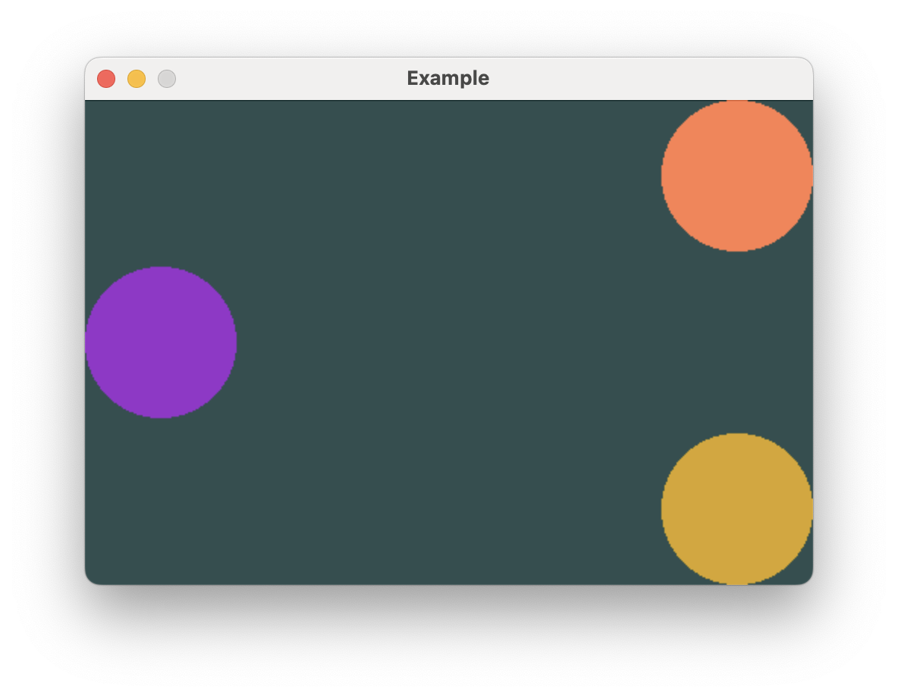

# Mixed Alignment

Consider creating the following view with these requirements:

- The purple circle should be aligned to the left, while the orange and yellow
circles should be aligned to the right.
- The layout should span the entire width of the window.
- The circles should all be roughly a third the height of the window, with a bit of spacing.



## Using `Spacer` to achieve alignment

You're probably thinking, "this feels like the perfect time to use `Spacer`!"

I'll briefly indulge this misconception.

```rust,no_run
# extern crate buoyant;
# extern crate embedded_graphics;
# extern crate embedded_graphics_simulator;
# use buoyant::{
#     environment::DefaultEnvironment,
#     layout::Layout as _,
#     render::{EmbeddedGraphicsRender as _, Renderable as _},
# };
#
# use embedded_graphics::{pixelcolor::Rgb888, prelude::*};
# use embedded_graphics_simulator::{OutputSettings, SimulatorDisplay, Window};
# 
# const BACKGROUND_COLOR: Rgb888 = Rgb888::CSS_DARK_SLATE_GRAY;
# const DEFAULT_COLOR: Rgb888 = Rgb888::WHITE;
# 
# fn main() {
#     let mut window = Window::new("Example", &OutputSettings::default());
#     let mut display: SimulatorDisplay<Rgb888> = SimulatorDisplay::new(Size::new(480, 320));
# 
#     display.clear(BACKGROUND_COLOR).unwrap();
# 
#     let environment = DefaultEnvironment::default();
#     let origin = buoyant::primitives::Point::zero();
# 
#     let view = view();
#     let layout = view.layout(&display.size().into(), &environment);
#     let render_tree = view.render_tree(&layout, origin, &environment);
# 
#     render_tree.render(&mut display, &DEFAULT_COLOR, origin);
# 
#     window.show_static(&display);
# }
# 
// No!
use buoyant::layout::HorizontalAlignment;
use buoyant::view::shape::Circle;
use buoyant::view::RenderExtensions as _;
use buoyant::view::{HStack, Spacer, VStack};
use buoyant::render::EmbeddedGraphicsView;

fn view() -> impl EmbeddedGraphicsView<Rgb888> {
    VStack::new((
        Circle.foreground_color(Rgb888::CSS_CORAL),
        HStack::new((
            Circle.foreground_color(Rgb888::CSS_DARK_ORCHID),
            Spacer::default(),
        )),
        Circle.foreground_color(Rgb888::CSS_GOLDENROD),
    ))
    .with_alignment(HorizontalAlignment::Trailing)
    .with_spacing(10)
}
```

The `VStack` is set to align the trailing edges of its children simply because it's more
convenient given there are more child views that need to be aligned to the right.

On their own, the `Circle`s would not result in the `VStack` spanning the entire width,
so an extra `HStack` is added with a `Spacer` to make sure at least one child spans the
full width. It even serves a dual purpose of aligning the purple `Circle` to the left side!

This *does* produce the desired result, but there's a better way to achieve it.

### A note for SwiftUI developers

In SwiftUI, Spacers have a 10 point minimum length. While it's probably not an issue
for this specific example, using the HStack+Spacer solution in SwiftUI without manually
overriding the Spacer minimum length results in 10 points of space your content can never
fill. Text wraps a bit early and you can't put your finger on why you feel a little sad.

This is *such* a common mistake in SwiftUI that Buoyant uses 0 as the default minimum `Spacer`
length. Now you can make this mistake and only I'll be sad.

## Flexible Frames

A better way to get the same result is to use the `flex_frame()` modifier, which is closely
related to the fixed `.frame()` modifier used earlier to set the width of the `Circle`
in the `contact_row` component.

Instead of setting fixed dimensions, flexible frames allow you to create a virtual frame
with configurable minimum and maximum dimensions. Child views won't necessarily take all
the space within this frame, so you can also specify horizontal and vertical alignment to
place the child within the virtual frame.

Buoyant provides `.with_infinite_max_width()` and `.with_infinite_max_height()` for creating
virtual frames that are as wide or tall as possible. You can use this in combination with
a leading horizontal alignment of the circle inside the frame to achieve the same result
as the previous code.

```rust,no_run
# extern crate buoyant;
# extern crate embedded_graphics;
# extern crate embedded_graphics_simulator;
#
# use buoyant::{
#     environment::DefaultEnvironment,
#     layout::Layout as _,
#     render::{EmbeddedGraphicsRender, Renderable},
# };
# use embedded_graphics::{pixelcolor::Rgb888, prelude::*};
# use embedded_graphics_simulator::{OutputSettings, SimulatorDisplay, Window};
# 
# const BACKGROUND_COLOR: Rgb888 = Rgb888::CSS_DARK_SLATE_GRAY;
# const DEFAULT_COLOR: Rgb888 = Rgb888::WHITE;
# 
# fn main() {
#     let mut window = Window::new("Example", &OutputSettings::default());
#     let mut display: SimulatorDisplay<Rgb888> = SimulatorDisplay::new(Size::new(480, 320));
# 
#     display.clear(BACKGROUND_COLOR).unwrap();
# 
#     let environment = DefaultEnvironment::default();
#     let origin = buoyant::primitives::Point::zero();
# 
#     let view = view();
#     let layout = view.layout(&display.size().into(), &environment);
#     let render_tree = view.render_tree(&layout, origin, &environment);
# 
#     render_tree.render(&mut display, &DEFAULT_COLOR, origin);
# 
#     window.show_static(&display);
# }
# 
// Preferred
use buoyant::layout::HorizontalAlignment;
use buoyant::view::shape::Circle;
use buoyant::view::VStack;
use buoyant::view::{LayoutExtensions as _, RenderExtensions as _};
use buoyant::render::EmbeddedGraphicsView;

fn view() -> impl EmbeddedGraphicsView<Rgb888> {
    VStack::new((
        Circle.foreground_color(Rgb888::CSS_CORAL),
        Circle
            .foreground_color(Rgb888::CSS_DARK_ORCHID)
            .flex_frame()
            .with_infinite_max_width()
            .with_horizontal_alignment(HorizontalAlignment::Leading),
        Circle.foreground_color(Rgb888::CSS_GOLDENROD),
    ))
    .with_alignment(HorizontalAlignment::Trailing)
    .with_spacing(10)
}
```

This is both faster for Buoyant to lay out and easier to read.

## Preferred implementations

This behavior is *so* common, shortcuts exist to specify an infinite width or height with
the alignment in one call.

### Maximally wide views

```rust
# extern crate buoyant;
# use buoyant::layout::HorizontalAlignment;
# use buoyant::view::LayoutExtensions as _;
# use buoyant::view::{shape::Circle, HStack, Spacer};
# let content = Circle;
// Avoid:
HStack::new((
    Spacer::default(),
    content,
))
# ;

// Preferred:
content
    .flex_frame()
    .with_infinite_max_width()
    .with_horizontal_alignment(HorizontalAlignment::Trailing)
# ;

// Preferred, shortcut:
content
    .flex_infinite_width(HorizontalAlignment::Trailing)
# ;
```

### Maximally tall views

```rust
# extern crate buoyant;
# use buoyant::layout::VerticalAlignment;
# use buoyant::view::LayoutExtensions as _;
# use buoyant::view::{shape::Circle, VStack, Spacer};
# let content = Circle;
// Avoid:
VStack::new((
    content,
    Spacer::default(),
))
# ;

// Preferred:
content
    .flex_frame()
    .with_infinite_max_height()
    .with_vertical_alignment(VerticalAlignment::Top)
# ;

// Preferred, shortcut:
content
    .flex_infinite_height(VerticalAlignment::Top)
# ;
```
