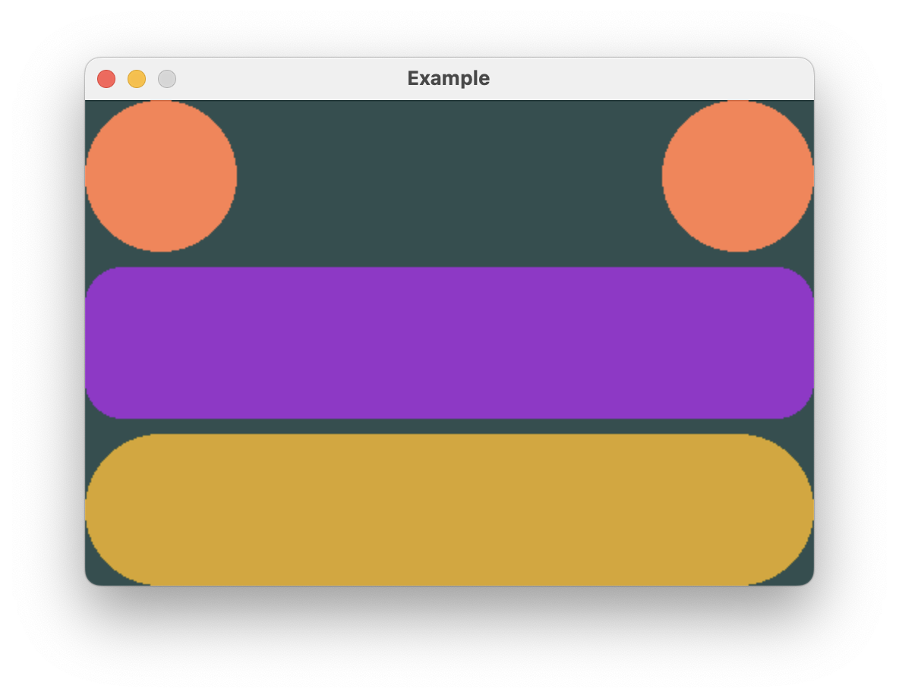

# Separating Views

`Spacer` is used as a sort of shim to create flexible spacing between views in a stack.

Here, `Spacer` is used to push the two `Circle`s to either side.



```rust,no_run
# extern crate buoyant;
# extern crate embedded_graphics;
# extern crate embedded_graphics_simulator;
# use buoyant::{
#     environment::DefaultEnvironment,
#     layout::Layout,
#     render::{EmbeddedGraphicsRender as _, Renderable as _},
# };
# use embedded_graphics::{pixelcolor::Rgb888, prelude::*};
# use embedded_graphics_simulator::{OutputSettings, SimulatorDisplay, Window};
# 
# const BACKGROUND_COLOR: Rgb888 = Rgb888::CSS_DARK_SLATE_GRAY;
# const DEFAULT_COLOR: Rgb888 = Rgb888::WHITE;
# 
# fn main() {
#     let mut window = Window::new("Example", &OutputSettings::default());
#     let mut display: SimulatorDisplay<Rgb888> = SimulatorDisplay::new(Size::new(480, 320));
# 
#     display.clear(BACKGROUND_COLOR).unwrap();
# 
#     let environment = DefaultEnvironment::default();
#     let origin = buoyant::primitives::Point::zero();
# 
#     let view = view();
#     let layout = view.layout(&display.size().into(), &environment);
#     let render_tree = view.render_tree(&layout, origin, &environment);
# 
#     render_tree.render(&mut display, &DEFAULT_COLOR, origin);
# 
#     window.show_static(&display);
# }
# 
use buoyant::layout::HorizontalAlignment;
use buoyant::view::shape::{Capsule, Circle, Rectangle};
use buoyant::view::RenderExtensions as _;
use buoyant::view::{HStack, Spacer, VStack};
use buoyant::render::EmbeddedGraphicsView;

fn view() -> impl EmbeddedGraphicsView<Rgb888> {
    VStack::new((
        HStack::new((
            Circle.foreground_color(Rgb888::CSS_CORAL),
            Spacer::default(),
            Circle.foreground_color(Rgb888::CSS_CORAL),
        )),
        Rectangle
            .corner_radius(25)
            .foreground_color(Rgb888::CSS_DARK_ORCHID),
        Capsule.foreground_color(Rgb888::CSS_GOLDENROD),
    ))
    .with_alignment(HorizontalAlignment::Trailing) // no effect!
    .with_spacing(10)
}
```

Note that with this update, changes to the `VStack` alignment no longer have any effect!
The `Spacer` forces the `HStack` to always take the full width offered by the `VStack`,
meaning the `VStack` child views will always have the same width. There is therefore no
ambiguity in the alignment of the `VStack` children.
