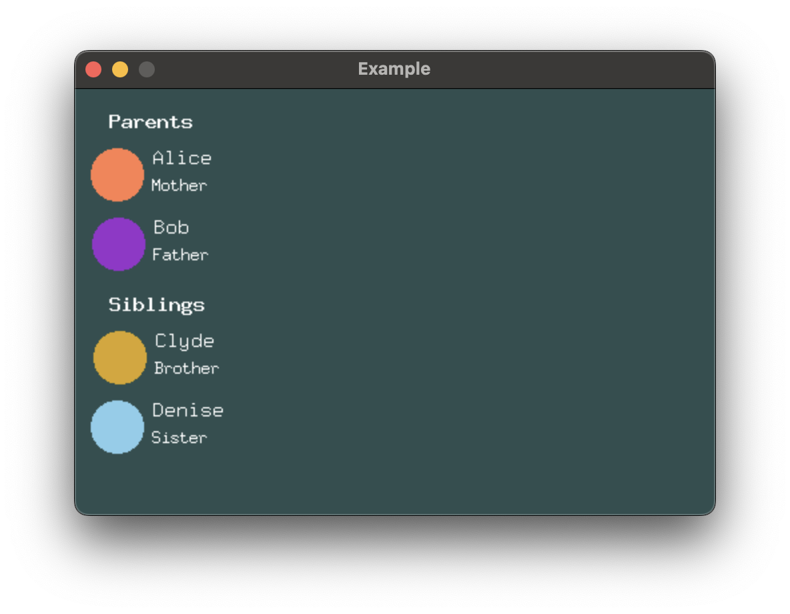

# Stack Spacing

Stack spacing is the first spacing you should reach for. It applies fixed
spacing between child views.

By default, `VStack` and `HStack` place their child views with no spacing in between.
You can configure the spacing between child views using `.with_spacing`.


```rust,no_run
# extern crate buoyant;
# extern crate embedded_graphics;
# extern crate embedded_graphics_simulator;
# use buoyant::{
#     environment::DefaultEnvironment,
#     layout::Layout,
#     render::{Render as _, Renderable as _},
#     render_target::{EmbeddedGraphicsRenderTarget, RenderTarget as _},
# };
# use embedded_graphics::{pixelcolor::Rgb888, prelude::*};
# use embedded_graphics_simulator::{OutputSettings, SimulatorDisplay, Window};
# 
# const BACKGROUND_COLOR: Rgb888 = Rgb888::CSS_DARK_SLATE_GRAY;
# const DEFAULT_COLOR: Rgb888 = Rgb888::WHITE;
# 
# fn main() {
#     let mut window = Window::new("Example", &OutputSettings::default());
#     let display: SimulatorDisplay<Rgb888> = SimulatorDisplay::new(Size::new(480, 320));
#     let mut target = EmbeddedGraphicsRenderTarget::new(display);
# 
#     target.clear(BACKGROUND_COLOR);
# 
#     let environment = DefaultEnvironment::default();
#     let origin = buoyant::primitives::Point::zero();
# 
#     let view = view();
#     let layout = view.layout(&target.display.size().into(), &environment);
#     let render_tree = view.render_tree(&layout, origin, &environment);
# 
#     render_tree.render(&mut target, &DEFAULT_COLOR, origin);
# 
#     window.show_static(&target.display);
# }
# 
use buoyant::layout::HorizontalAlignment;
use buoyant::view::shape::{Capsule, Circle, Rectangle};
use buoyant::view::{View, ViewExt as _};
use buoyant::view::VStack;

fn view() -> impl View<Rgb888> {
    VStack::new((
        Circle.foreground_color(Rgb888::CSS_CORAL),
        Rectangle
            .corner_radius(25)
            .foreground_color(Rgb888::CSS_DARK_ORCHID),
        Capsule.foreground_color(Rgb888::CSS_GOLDENROD),
    ))
    .with_alignment(HorizontalAlignment::Trailing)
    .with_spacing(10)
}
```

## Creating Visual Hierarchy

Often, you'll want to create a hierarchy which visually separates primitive elements,
components, and sections of components. You can achieve this by nesting stacks and using
incrementally larger values for each class of separation.


```rust,no_run
# extern crate buoyant;
# extern crate embedded_graphics;
# extern crate embedded_graphics_simulator;
# use buoyant::{
#     environment::DefaultEnvironment,
#     layout::Layout,
#     render::{Render as _, Renderable as _},
#     render_target::{EmbeddedGraphicsRenderTarget, RenderTarget as _},
# };
# use embedded_graphics_simulator::{OutputSettings, SimulatorDisplay, Window};
# 
# const BACKGROUND_COLOR: Rgb888 = Rgb888::CSS_DARK_SLATE_GRAY;
# const DEFAULT_COLOR: Rgb888 = Rgb888::WHITE;
# 
# fn main() {
#     let mut window = Window::new("Example", &OutputSettings::default());
#     let display: SimulatorDisplay<Rgb888> = SimulatorDisplay::new(Size::new(480, 320));
#     let mut target = EmbeddedGraphicsRenderTarget::new(display);
# 
#     target.clear(BACKGROUND_COLOR);
# 
#     let environment = DefaultEnvironment::default();
#     let origin = buoyant::primitives::Point::zero();
# 
#     let view = view();
#     let layout = view.layout(&target.display.size().into(), &environment);
#     let render_tree = view.render_tree(&layout, origin, &environment);
# 
#     render_tree.render(&mut target, &DEFAULT_COLOR, origin);
# 
#     window.show_static(&target.display);
# }
# 
use buoyant::layout::{HorizontalAlignment, VerticalAlignment};
use buoyant::view::padding::Edges;
use buoyant::view::shape::Circle;
use buoyant::view::{HStack, Text, VStack};
use buoyant::view::{View, ViewExt as _};
use embedded_graphics::{
    mono_font::ascii::{FONT_7X13, FONT_9X15, FONT_9X15_BOLD},
    pixelcolor::Rgb888,
    prelude::*,
};

mod spacing {
    pub const ELEMENT: u32 = 6;
    pub const COMPONENT: u32 = 12;
    pub const SECTION: u32 = 18;
}

fn view() -> impl View<Rgb888> {
    VStack::new((
        VStack::new((
            Text::new("Parents", &FONT_9X15_BOLD),
            contact_row(Rgb888::CSS_CORAL, "Alice", "Mother"),
            contact_row(Rgb888::CSS_DARK_ORCHID, "Bob", "Father"),
        ))
        .with_alignment(HorizontalAlignment::Leading)
        .with_spacing(spacing::COMPONENT),
        VStack::new((
            Text::new("Siblings", &FONT_9X15_BOLD),
            contact_row(Rgb888::CSS_GOLDENROD, "Clyde", "Brother"),
            contact_row(Rgb888::CSS_SKY_BLUE, "Denise", "Sister"),
        ))
        .with_alignment(HorizontalAlignment::Leading)
        .with_spacing(spacing::COMPONENT),
    ))
    .with_alignment(HorizontalAlignment::Leading)
    .with_spacing(spacing::SECTION)
    .padding(Edges::Horizontal, spacing::COMPONENT)
    .padding(Edges::Vertical, spacing::SECTION)
}

fn contact_row<'a>(
    color: Rgb888,
    name: &'a str,
    relationship: &'a str,
) -> impl View<Rgb888> + use<'a> {
    HStack::new((
        Circle.foreground_color(color).frame().with_width(40),
        VStack::new((
            Text::new(name, &FONT_9X15),
            Text::new(relationship, &FONT_7X13),
        ))
        .with_alignment(HorizontalAlignment::Leading)
        .with_spacing(spacing::ELEMENT)
        .foreground_color(Rgb888::WHITE),
    ))
    .with_alignment(VerticalAlignment::Top)
    .with_spacing(spacing::ELEMENT)
}
```

The frames of Buoyant built-in views are always tight to the rendered content[^note]. You
should strive to maintain this property in your custom component views. Without it,
you'll find it difficult to maintain well-organized hierarchies.

## Watch out for alignment

Make sure you pay close attention to the alignment you set on each stack. Forgetting the
alignment on the components `VStack`s would give you this weird result. Note how the frame
of the outer `VStack` only actually extends to the end of the longest text.



While it's fairly obvious here that something is off, it can be much more subtle when you have
text that spans the entire window width. Depending on where the text wraps, you may only
sometimes see the problem.

[^note]: Text rendered with `embedded-graphics` monospace fonts break the "tight frames" rule.
If you look closely, you'll see that names which render entirely above the baseline
(no g, j, p, q, or y) appear to have weird extra spacing underneath that doesn't match the
other nearby element spacing. This is what you're trying to avoid by ensuring your frames
are tight to the rendered content.
