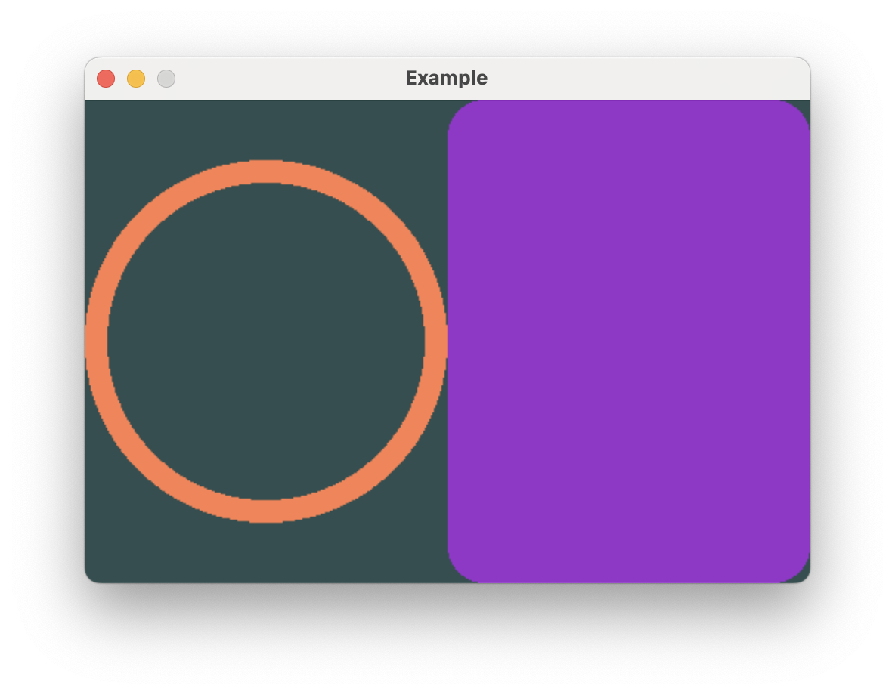
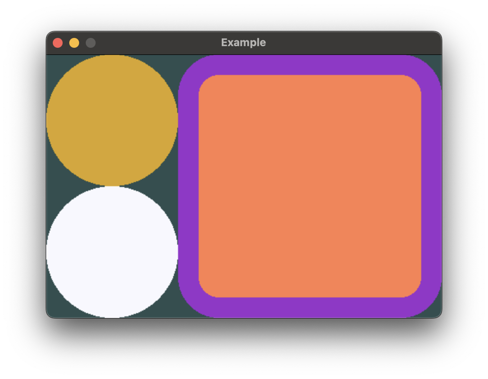

# Stacks

## Adjacent layout

`HStack` and `VStack` are the primary tools you'll use to arrange views side-by-side in Buoyant.
Both stacks can contain a heterogeneous set of views and can be nested inside other stacks.



```rust,no_run
# extern crate buoyant;
# extern crate embedded_graphics;
# extern crate embedded_graphics_simulator;
# use embedded_graphics::{pixelcolor::Rgb888, prelude::*};
# use embedded_graphics_simulator::{OutputSettings, SimulatorDisplay, Window};
# 
# const BACKGROUND_COLOR: Rgb888 = Rgb888::CSS_DARK_SLATE_GRAY;
# const DEFAULT_COLOR: Rgb888 = Rgb888::WHITE;
# 
# fn main() {
#     let mut window = Window::new("Example", &OutputSettings::default());
#     let mut display: SimulatorDisplay<Rgb888> = SimulatorDisplay::new(Size::new(480, 320));
# 
#     display.clear(BACKGROUND_COLOR).unwrap();
# 
#     view()
#         .as_drawable(display.size(), DEFAULT_COLOR)
#         .draw(&mut display)
#         .unwrap();
# 
#     window.show_static(&display);
# }
# 
use buoyant::view::prelude::*;

fn view() -> impl View<Rgb888> {
    HStack::new((
        Circle.foreground_color(Rgb888::CSS_CORAL),
        Rectangle
            .corner_radius(25)
            .foreground_color(Rgb888::CSS_DARK_ORCHID),
    ))
}
```

In this example, you can see ``HStack`` fairly offers both views half the available width.
``Rectangle`` greedily takes all the offered space on both axes, while ``Circle`` only takes
space greedily on the shorter axis to retain its square aspect ratio.

## Arranging views on top of each other

`ZStack` can be used to overlay views on top of each other. Like `HStack` and `VStack`,
it can contain a heterogeneous set of views.


```rust,no_run
# extern crate buoyant;
# extern crate embedded_graphics;
# extern crate embedded_graphics_simulator;
# use embedded_graphics::{pixelcolor::Rgb888, prelude::*};
# use embedded_graphics_simulator::{OutputSettings, SimulatorDisplay, Window};
# 
# const BACKGROUND_COLOR: Rgb888 = Rgb888::CSS_DARK_SLATE_GRAY;
# const DEFAULT_COLOR: Rgb888 = Rgb888::WHITE;
# 
# fn main() {
#     let mut window = Window::new("Example", &OutputSettings::default());
#     let mut display: SimulatorDisplay<Rgb888> = SimulatorDisplay::new(Size::new(480, 320));
# 
#     display.clear(BACKGROUND_COLOR).unwrap();
# 
#     view()
#         .as_drawable(display.size(), DEFAULT_COLOR)
#         .draw(&mut display)
#         .unwrap();
# 
#     window.show_static(&display);
# }
# 
use buoyant::view::prelude::*;

fn view() -> impl View<Rgb888> {
    ZStack::new((
        Rectangle
            .corner_radius(50)
            .foreground_color(Rgb888::CSS_DARK_ORCHID),
        Circle.foreground_color(Rgb888::CSS_CORAL),
        Circle
            .foreground_color(Rgb888::CSS_GOLDENROD)
            .padding(Edges::All, 25),
    ))
}
```

The `.padding()` modifier is useful here to create space around the topmost yellow circle.

## Combining Stacks

Stacks can be nested to create complex layouts.



```rust,no_run
# extern crate buoyant;
# extern crate embedded_graphics;
# extern crate embedded_graphics_simulator;
# use embedded_graphics::{pixelcolor::Rgb888, prelude::*};
# use embedded_graphics_simulator::{OutputSettings, SimulatorDisplay, Window};
# 
# const BACKGROUND_COLOR: Rgb888 = Rgb888::CSS_DARK_SLATE_GRAY;
# const DEFAULT_COLOR: Rgb888 = Rgb888::WHITE;
# 
# fn main() {
#     let mut window = Window::new("Example", &OutputSettings::default());
#     let mut display: SimulatorDisplay<Rgb888> = SimulatorDisplay::new(Size::new(480, 320));
# 
#     display.clear(BACKGROUND_COLOR).unwrap();
# 
#     view()
#         .as_drawable(display.size(), DEFAULT_COLOR)
#         .draw(&mut display)
#         .unwrap();
# 
#     window.show_static(&display);
# }
# 
use buoyant::view::prelude::*;

fn view() -> impl View<Rgb888> {
    HStack::new((
        VStack::new((
            Circle.foreground_color(Rgb888::CSS_GOLDENROD),
            Circle.foreground_color(Rgb888::CSS_GHOST_WHITE),
        )),
        ZStack::new((
            Rectangle
                .corner_radius(50)
                .foreground_color(Rgb888::CSS_DARK_ORCHID),
            Rectangle
                .corner_radius(25)
                .foreground_color(Rgb888::CSS_CORAL)
                .padding(Edges::All, 25),
        )),
    ))
}
```

> Stack conformance to the necessary traits is macro-derived up to stacks of 10 views
