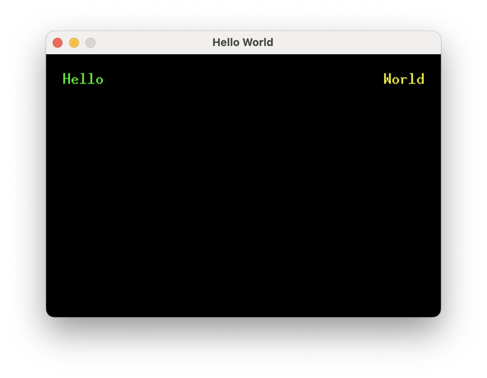

# Quickstart

## Embedded graphics simulator

To run examples, you'll need to follow the instructions in the [embedded-graphics-simulator](https://github.com/embedded-graphics/simulator)
README to install sdl2.

## Add dependencies

```toml
# Cargo.toml

[dependencies]
buoyant = "0.4"
embedded-graphics = "0.8"
embedded-graphics-simulator = "0.7.0"
```

## Hello World

Running this example will result in the words "Hello" (green) and "World" (yellow)
separated by as much space as possible, with 20 pixels of padding around the edges.



Here is the full example, which will be picked apart in the following sections:

```rust,no_run
# extern crate buoyant;
# extern crate embedded_graphics;
# extern crate embedded_graphics_simulator;
#
{{#include quickstart.rs:all}}
```

## Simulator Boilerplate

This is more or less the bare minimum to get a window up and running with the simulator.

```rust,no_run
# extern crate buoyant;
# extern crate embedded_graphics;
# extern crate embedded_graphics_simulator;
#
{{#include quickstart.rs:simulator}}
    // Render to display...
{{#include quickstart.rs:simulator2}}
```

A window and a display framebuffer are created. `display` importantly conforms to
`embedded_graphics::DrawTarget<Color = Rgb888>` and is what you'll render content into.

The framebuffer is cleared to the background color, content is rendered, and finally the framebuffer
is displayed.

## Environment

```rust
# extern crate buoyant;
# use buoyant::environment::DefaultEnvironment;
#
let environment = DefaultEnvironment::default();
let origin = buoyant::primitives::Point::zero();
```

For static views with no animation, the environment is mostly irrelevant and the default
environment will suffice.

If this view involved animation, the environment would be used to inject the time
(as a duration), which you'd set every time you produce a new view.

## View Body

```rust
# extern crate buoyant;
# extern crate embedded_graphics;
#
# use buoyant::view::{padding::Edges, HStack, LayoutExtensions as _, RenderExtensions as _, Spacer, Text};
# use buoyant::render::EmbeddedGraphicsView;
# use embedded_graphics::{mono_font::ascii::FONT_10X20, pixelcolor::Rgb888, prelude::*};
#
{{#include quickstart.rs:view}}
```

The view body returned from this function simply encodes the structure and relationships between
elements, along with holding references to resources like text and fonts. Note it has no notion
of size or position.

This is an example of a component view. Unlike SwiftUI where views are types, Buoyant components
are functions (sometimes on types). You can take this view and compose it with other views
the same way built-in components like `Text` are used.

Because embedded-graphics displays come in a wide variety of color spaces, component views
must also specify a color space. Often it's useful to alias this to make migration to another
screen easy, with e.g. `type color_space = Rgb888`.

## Layout

```rust,ignore
let layout = view.layout(&display.size().into(), &environment);
```

The layout call resolves the sizes of all the views. It is a bug to try to reuse the layout
after mutating the view, and Buoyant may panic if you do so.

## Render Tree

```rust,ignore
let render_tree = view.render_tree(&layout, origin, &environment);
```

The render tree is a minimal snapshot of the view. It holds a copy of the resolved positions,
sizes, colors, etc. of all the elements that are actually rendered to the screen.
Relational elements like `Padding`, `Frame`s, alignment, and so on have been stripped.

For rendering a static view, this feels like (and is) a lot of boilerplate from Buoyant.
However, as you'll see later, having multiple snapshots allows incredibly powerful animation
with next to no effort.

## Rendering

```rust,ignore
render_tree.render(&mut display, &DEFAULT_COLOR, origin);
```

Here, the snapshot is finally rendered to the display buffer. A default color, similar to SwiftUI's
foreground color, is passed in. This is used for elements that don't have a color set.
